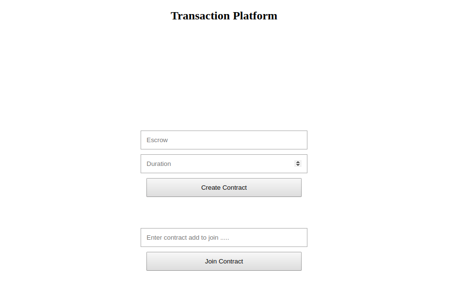
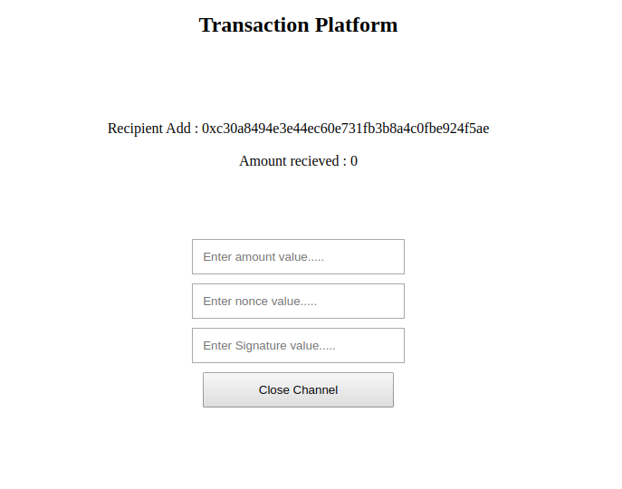
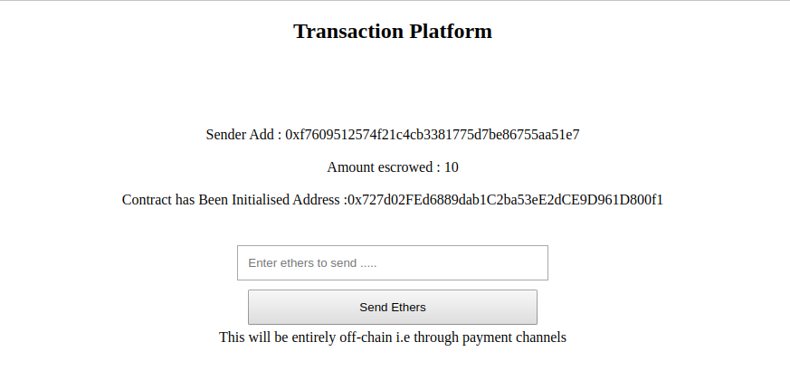

# Off Chain -Blockchain

This Projects aims at escrowing ethers. Whole system is run on ethereum blockchain tracking all executed transactions for maintaining transparency and authenticity.

Sender can pay ethers off-Chain and sign the transanction. That signature will be verified on recipient's end. If in any case ethers get locked in the contract and recipient is not closing the channel then sender can claim TimeOut and if that the case than ethers will be send back to sender. Recipient has to claim payment to get ethers.

# Pre-Requisite

- Npm : To run application on Web
- Truffle : To develop smart Contract, Compile, Test and migrate.
- MetaMask : To talk with ethereum blockchain.

# Interface





# How to run this repository.

- First clone this repository and make sure you are in the same repository.
- Type npm install in terminal : It will install all dependencies mentioned in package.json file
  ```sh
   npm install
  ```
- Type truffle Compile in terminal
  ```sh
   truffle Compile
  ```
 - Type truffle migrate
    ```sh
     truffle migrate
   ```
  - Open app folder in the repo and run npm run dev. This will provide localhost address where our web app will run.
    ```sh
    npm run dev
     ```
   - Run localhost:8080 on chrome where metmask should be connected.
   - This will run project and there after you can execute transactions and look at console to see messages.
